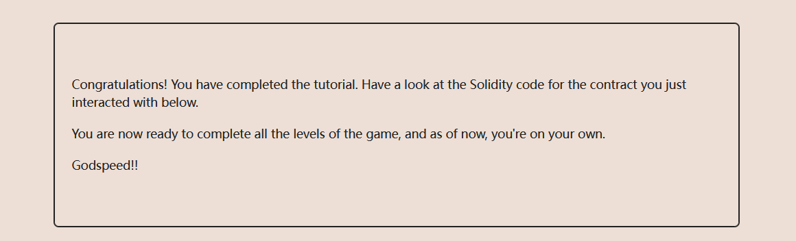

在页面底部先要点击Get new instance


在控制台依次输入：
```
await contract.info()

await contract.info1()

await contract.info2("hello")

await contract.infoNum()

await contract.info42()

await contract.theMethodName()

await contract.method7123949()

await contract.password()

await contract.authenticate("ethernaut0")
```

这个没什么可分析的，依次按照提示执行即可，主要是熟悉靶场。
最后点击submit instance，就能获取当前关卡源代码。
