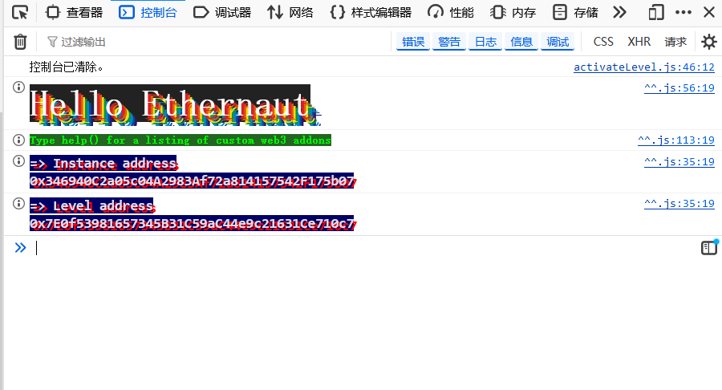

# Ethernaut学习之路

## 介绍
Ethernaut是一个用来学习智能合约审计的学习平台，采用 CTF（夺旗赛）闯关模式，每一关都是一个带有真实漏洞的智能合约。   

## 环境配置
Firefox浏览器
MetaMask插件(https://metamask.io/)
为自己的MetaMask中充值测试用ETH（Sepolia ETH）

## 背景知识
* 浏览器控制台
按F12打开，有个console模块：

Ethernaut 页面已经预装了 Web3.js 或 Ethers.js 库，并注入了关键对象。你不需要安装复杂的开发环境，直接在 Console 即可完成与区块链的实时交互。

* 需要掌握的快捷对象

player：当前你的钱包地址（攻击者地址）。

contract：当前关卡的合约实例（你的攻击目标）。

help：获取帮助。

Ethernaut：查看当前以太坊合约所有可用方法。

* 常用交互指令命令表
  
| 命令 | 作用 |
| :--- | :--- |
| await contract.address | 查看当前目标的合约地址 |
| await getBalance(player) | 查看自己还剩多少测试币 |
| await contract.someMethod() | 调用合约的某个函数 |
| toWei('0.1') | 将 0.1 ETH 转换为最小单位 Wei |

## 每一关的标准流程：

Get New Instance：点击后，在 Sepolia 链上生成一个你的专属靶机。

Analyze Code：阅读页面提供的 Solidity 源码，寻找逻辑漏洞。

Hack：在 Console 编写代码或通过 Remix 发动攻击。

Submit Instance：点击提交，若逻辑正确，后台会判定通过并解锁下一关。